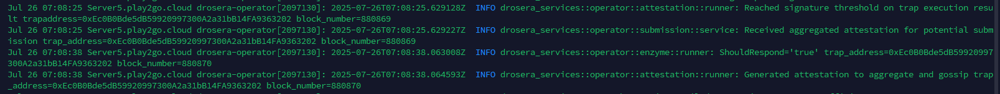
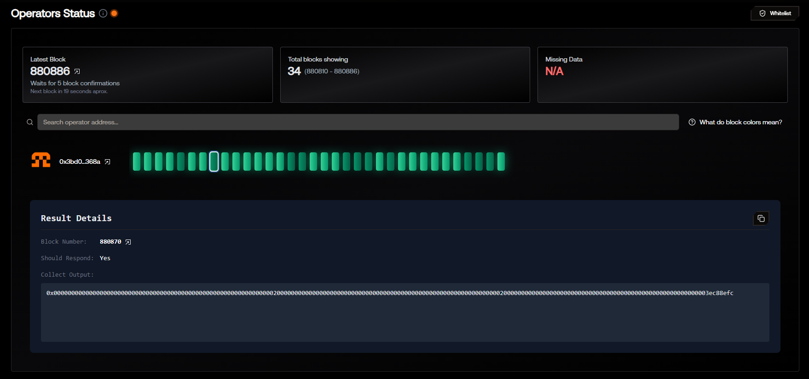

# ⛽️ BasefeeSpikeTrap — Drosera Custom Trap

> 🧠 Custom trap for detecting abnormal basefee volatility in Ethereum Hoodi testnet  
> 🧪 Uses live `block.basefee` as data source, compares between blocks, and triggers alert on anomaly

---

## 📍 Introduction

This trap is designed for **Drosera operators** to demonstrate advanced trap-building skills.  
The idea is to **detect real-time spikes in gas basefee**, which may indicate unusual network activity (spam, congestion, manipulation).

Unlike static value traps, this one leverages live network conditions via `block.basefee`, reacts dynamically, and is a great candidate for testing real conditions of anomaly detection in blockchain metrics.

---

## 🛠 Trap Summary

| Parameter              | Value                          |
|------------------------|---------------------------------|
| **Network**            | Ethereum Hoodi testnet         |
| **Trap Type**          | Volatility Detector            |
| **Trigger Source**     | `block.basefee`                |
| **Trigger Threshold**  | ≥ 0.12 gwei (120_000_000 wei)   |
| **Data Window**        | 2 blocks                       |
| **Respond Action**     | Emits alert via `logGasSpike`  |
| **Response Contract**  | `GasAlertReceiver.sol`         |
| **Operator Role**      | Sergeant / Captain             |

---

## 💡 Trap Logic Overview

1. `collect()` records the current block's basefee.
2. `shouldRespond()` compares `basefee` from two recent blocks.
3. If the difference exceeds `THRESHOLD`, the trap returns `true`.
4. If true, Drosera executes `logGasSpike(string)` in the receiver contract.

---

## 🔗 Files Included

```
BasefeeSpikeTrap/
├── src/
│   ├── BasefeeSpikeTrap.sol         # Main trap logic
│   └── GasAlertReceiver.sol         # Contract triggered upon anomaly
├── drosera.toml                     # Drosera node config
├── images/
│   ├── logs.png                     # Screenshot of shouldRespond=true
│   └── block.png                    # Screenshot of dark-green block
└── README.md                        # This file
```

---

## 📦 BasefeeSpikeTrap.sol

```solidity
// SPDX-License-Identifier: MIT
pragma solidity ^0.8.20;

interface ITrap {
    function collect() external view returns (bytes memory);
    function shouldRespond(bytes[] calldata data) external pure returns (bool, bytes memory);
}

contract BasefeeSpikeTrap is ITrap {
    uint256 public constant THRESHOLD = 120_000_000; // 0.12 gwei

    function collect() external view override returns (bytes memory) {
        return abi.encode(block.basefee);
    }

    function shouldRespond(bytes[] calldata data) external pure override returns (bool, bytes memory) {
        if (data.length < 2) return (false, "Insufficient data");

        uint256 current = abi.decode(data[0], (uint256));
        uint256 previous = abi.decode(data[1], (uint256));
        uint256 diff = current > previous ? current - previous : previous - current;

        if (diff >= THRESHOLD) {
            return (true, abi.encode("Basefee spike detected"));
        }

        return (false, "");
    }
}
```

---

## 🧲 GasAlertReceiver.sol

```solidity
// SPDX-License-Identifier: MIT
pragma solidity ^0.8.20;

contract GasAlertReceiver {
    event GasAlert(string info);

    function logGasSpike(string calldata info) external {
        emit GasAlert(info);
    }
}
```

---

## 🧩 drosera.toml Configuration

```toml
[traps.drop_trigger]
path = "out/BasefeeSpikeTrap.sol/BasefeeSpikeTrap.json"
response_contract = "0xRECEIVER_CONTRACT"
response_function = "logGasSpike(string)"
cooldown_period_blocks = 33
min_number_of_operators = 1
max_number_of_operators = 2
block_sample_size = 10
private_trap = true
whitelist = ["0xYOUR_OPERATOR_ADDRESS"]
address = "0xYOUR_TRAP_CONTRACT"
```

---

## ✅ Trap Deployment Steps

1. Wrote Solidity code for `BasefeeSpikeTrap` and `GasAlertReceiver`.
2. Deployed the receiver contract:
   ```bash
   forge create --rpc-url https://ethereum-hoodi-rpc.publicnode.com --broadcast --private-key 0x... src/GasAlertReceiver.sol:GasAlertReceiver
   ```
3. Compiled the trap:
   ```bash
   forge build
   ```
4. Applied config:
   ```bash
   DROSERA_PRIVATE_KEY=0x... drosera apply
   ```
5. Validated trap response and dashboard view.

---

## 🧪 Trap Behavior — Sample Evidence

### Log: `ShouldRespond = true`

```bash
INFO drosera_services::operator::attestation::runner: Reached signature threshold on trap execution result trapaddress=0xEc0B0Bde5dB59920997300A2a31bB14FA9363202 block_number=880870
```

📸 

---

### Dashboard View (Dark Green Block)

📸 

---

## 🛠 Useful Notes

- The trap is stable and does not over-trigger thanks to the `THRESHOLD`.
- `block.basefee` is a reliable metric and reflects real-time network gas pressure.
- Operator config includes cooldowns and whitelisting to avoid over-response.

---

## 🎯 Role Application

I'm applying for the following roles based on this custom implementation:

- 🪖 **Sergeant**
- 🧢 **Captain**

---

## 🔗 Addresses

| Name              | Address                |
|-------------------|-------------------------|
| Trap Contract     | `0xTRAP_ADDRESS`        |
| Receiver Contract | `0xRECEIVER_ADDRESS`    |
| Operator Wallet   | `0xOPERATOR_ADDRESS`    |

---

## 💬 Contact Info

- **Discord**: `@gkutueva`
- **TG**: `@MityaTgm`

---
